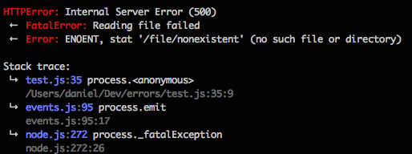

# fancy-errors

Node.js developer's Swiss Army knife for those damned errors.


  
## Features

- Named errors & codes (beauties like `ValidationError`, `FileNotFoundError` or `HTTPError`)
- Error wrapping that helps you catch 'em all!
- Utility functions for catching and logging errors
- Translates `.errno` like 'ENOENT' into more meaningful message
- Pretty and colorful error stacks
- sprintf support (via util.format)
- Pre-defined common errors
- and your own custom errors

## Install

```shell
$ npm install fancy-errors
```

## Basic usage

```js
var errors = require('fancy-errors');

// Simple error
throw new errors.Error('Something went %s wrong', 'terribly');

// HTTPError, throws err.code = 404, err.message = 'Not found'
throw new errors.HTTPError(404);

// Custom error name
throw new errors.NamedError('PaymentGatewayError', 'Error message');
```

## Wrapping

```js
require('fs').stat('/file/nonexistent', function(err, stats){
  if(err){
    throw new error.Error(err, 'Reading stats failed');
  }
});
```

will produce this output:

```shell
Error: Reading stats failed
 ←  Error: ENOENT, stat '/file/nonexistent' (no such file or directory)

Stack trace:
 ↳  test.js:36
 ...
```

You can wrap as many errors as you need:

```js
var err1 = new errors.Error('Low level error');
var err2 = new errors.Error(err1, 'Higher level error');
var err3 = new errors.Error(err2, 'Top level error');

console.log(err3.stack);
```

this will produce something like this:

```shell
Error: Top level error
 ←  Error: Higher level error
 ←  Error: Low level error
 ...
```

## Error names

Is there any easier way how to programmatically handle errors then using `err.name`? 

```js
try {
  if(!url){
    throw new error.ArgumentError('Invalid URL');
  }
  throw new errors.HTTPError(500);
  
} catch (err){
  if(err.name === 'HTTPError'){
    res.statusCode = err.code;
    res.end(err.message);
    
  } else if(err.name === 'ArgumentError') {
    res.end(err.message);
  }
}
```

## Error codes

The `.code` property can be populated directly from the error's message if the message begins with capitalized word followed by a comma.

```js
var err = new errors.Error('INVALID_USERNAME, Username not found');
console.log(err.code); // outputs `INVALID_USERNAME`
```

## Pre-defined errors
- `AuthenticationError(message)`
- `ArgumentError(message)`
- `ConflictError(message)`
- `ConnectionError(message)`
- `DirectoryNotFoundError(message)`
- `FatalError(message)`
- `FileLoadError(message)`
- `FileNotFoundError(message)`
- `ForbiddenError(message)`
- `HTTPError(statusCode, statusMessage)`
- `IOError(message)`
- `InvalidParameterError(parameterName, message)`
- `MissingParameterError(parameterName, message)`
- `NotAcceptableError(message)`
- `NotAllowedError(message)`
- `NotFoundError(message)`
- `PreconditionError(message)`
- `RangeError(message)`
- `RateLimiterError(message)`
- `ReferenceError(message)`
- `ResourceBusyError(message)`
- `TimeoutError(message)`
- `TooLargeError(message)`
- `TypeError(message)`
- `UnsupportedError(message)`
- `URIError(message)`
- `URITooLongError(message)`
- `ValidationError(message)`

## Define your own

You can also define your own errors using `.define` helper:

```js
errors.define('MyFancyError', 'This is some fancy default message');
throw new errors.MyFancyError();
```

this will output:

```shell
MyFancyError: This is some fancy default message
...
```

## What the \*\*\*\* is ENOENT?

You should already know what ENOENT means, but still it is nice to have some meaningful error message.
When you wrap an error with .errno property, a human-readable string will be appended to the error's message.

Transforms this ugly beast:

```shell
Error: ENOENT, stat '/file/nonexistent'
```

into this beauty:
```shell
Error: ENOENT, stat '/file/nonexistent' (no such file or directory)
```

## .catch

This helper makes it easier to handle error passed into the callback.

This example silently ignores any incoming error:

```js
someFunc(function(err, data){
  if(!errors.catch(err)){
    // all good, .catch returns `undefined` if there is no error
  }
});
```

But if you need to wrap this function and properly call the callback with an error:

```js
function readFile(callback){
  someFunc(function(err, data){
    // .catch will call `callback` with an error if present
    if(!errors.catch(err, callback)){
      callback(undefined, data);
    }
  });
}
```
.catch does something similar to this:

```js
if(err){
  if(typeof callback === 'function'){
    callback(err);
  }
} else {
  // all good
}
```


## .log

This helper is in it's way similar to `.catch`, but instead of ignoring the error or passing it to the callback, it simple outputs the error to *stderr*

```js
someFunc(function(err, data){
  if(!errors.log(err)){
    // all good, .log returns `undefined` if there is no error
  }
});
```
.log does something similar to this:

```js
if(err){
  console.error(err);
} else {
  // all good
}
```

## .fatal

Sometimes it is needed to simply throw an error if it occurs and `.fatal` will hadle this case for you. It will also wrap the original error with your message.

```js
someFunc(function(err, data){
  errors.fatal(err, 'Reading data failed');
  
  // all good here, .fatal will throw only if there is an error
});
```

will output:

```shell
FatalError: Reading data failed
 ←  Error: ENOENT, stat '/file/nonexistent' (no such file or directory)
 ...
```

## .statusCode(err)

This helper function returns a HTTP status code for the given error.

```js
errors.statusCode(new errors.NotFoundError()); // returns 404
```

## .serialize()

Returns simple object represenatation of the error usually used for logging or for the server response.

```js
errors.serialize(new errors.NotFoundError('File /file/nonexistent not found'));

{
  "error": "File /file/nonexistent not found",
  "error_name": "NotFoundError",
  "error_code": undefined
}
```
  
## Pretty stack

Error stack is automaticaly prettified. But this feature is available only in `development` environment (`NODE_ENV`). In production, you will get standard stack as you know it.

## Test

```shell
$ npm test
```
  
## License

MIT
